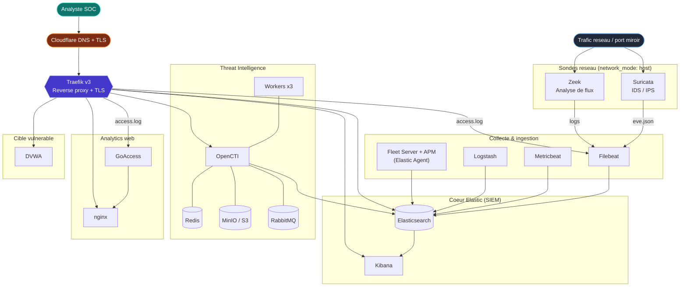

# 🛰️ Sonde — Plateforme de supervision & détection réseau

> Stack tout-en-un de **Network Security Monitoring (NSM)** orchestrée avec Docker Compose : capture réseau (Suricata / Zeek), SIEM Elastic, Threat Intelligence (OpenCTI), analytics web et reverse proxy TLS automatique.

<p align="center">
  
  
  
  
  
</p>

---

## 📑 Sommaire

- [Présentation](#-présentation)
- [Schéma d'architecture](#️-schéma-darchitecture)
- [Stack technique & logos](#-stack-technique--logos)
- [Composants & services](#-composants--services)
- [Prérequis](#-prérequis)
- [Installation](#-installation)
- [Accès aux interfaces](#-accès-aux-interfaces)
- [Structure du projet](#-structure-du-projet)

---

## 🎯 Présentation

**Sonde** déploie une sonde de détection réseau complète et un SOC miniature sur un seul hôte.
Le trafic réseau est capturé par des sondes (**Suricata**, **Zeek**), normalisé puis ingéré
par la **stack Elastic** (Beats → Logstash → Elasticsearch → Kibana). Les indicateurs de
compromission sont gérés dans **OpenCTI**, les logs HTTP visualisés en temps réel via
**GoAccess**, et l'ensemble des interfaces est exposé derrière **Traefik** avec des
certificats Let's Encrypt obtenus automatiquement (DNS-challenge Cloudflare).

Une application volontairement vulnérable (**DVWA**) est incluse pour générer du trafic
d'attaque et tester la chaîne de détection de bout en bout.

| Domaine | Outils |
|---------|--------|
| 🛰️ Capture / Sondes | Suricata, Zeek |
| 📦 Collecte & ingestion | Filebeat, Metricbeat, Logstash, Fleet Server + APM |
| 🔎 SIEM | Elasticsearch, Kibana |
| 🧠 Threat Intelligence | OpenCTI (+ Redis, MinIO, RabbitMQ) |
| 📊 Analytics web | GoAccess + nginx |
| 🌐 Reverse proxy / TLS | Traefik + Cloudflare |
| 🎯 Lab | DVWA |

---

## 🏗️ Schéma d'architecture



> 💡 Le diagramme est rendu nativement sur GitHub. Version éditable : [ouvrir sur Mermaid Live](https://l.mermaid.ai/aHUNBA).

**Flux de données :**
1. Les **sondes** Suricata & Zeek écoutent l'interface réseau (`network_mode: host`) et écrivent leurs journaux sur disque.
2. **Filebeat** collecte ces journaux (+ logs Traefik & conteneurs Docker), **Metricbeat** les métriques, **Logstash** les ingestions custom.
3. Tout converge vers **Elasticsearch** (chiffré TLS) et se visualise dans **Kibana**.
4. **OpenCTI** corrèle la threat intelligence et indexe dans Elasticsearch.
5. **Traefik** publie chaque interface en HTTPS sur `*.sonde.dylanlasjunies.fr`.

---

## 🧰 Stack technique & logos

<table>
  <tr>
    <td align="center" width="150">
      <br/>
      <sub><b>Elasticsearch</b></sub>
    </td>
    <td align="center" width="150">
      <br/>
      <sub><b>Kibana</b></sub>
    </td>
    <td align="center" width="150">
      <br/>
      <sub><b>Logstash</b></sub>
    </td>
    <td align="center" width="150">
      <br/>
      <sub><b>Beats / Fleet</b></sub>
    </td>
  </tr>
  <tr>
    <td align="center">
      <br/>
      <sub><b>Suricata</b></sub>
    </td>
    <td align="center">
      <br/>
      <sub><b>Zeek</b></sub>
    </td>
    <td align="center">
      <br/>
      <sub><b>Traefik</b></sub>
    </td>
    <td align="center">
      <br/>
      <sub><b>Cloudflare</b></sub>
    </td>
  </tr>
  <tr>
    <td align="center">
      <br/>
      <sub><b>OpenCTI</b></sub>
    </td>
    <td align="center">
      <br/>
      <sub><b>Redis</b></sub>
    </td>
    <td align="center">
      <br/>
      <sub><b>RabbitMQ</b></sub>
    </td>
    <td align="center">
      <br/>
      <sub><b>MinIO</b></sub>
    </td>
  </tr>
  <tr>
    <td align="center">
      <br/>
      <sub><b>nginx</b></sub>
    </td>
    <td align="center">
      <br/>
      <sub><b>GoAccess</b></sub>
    </td>
    <td align="center">
      <br/>
      <sub><b>Docker</b></sub>
    </td>
    <td align="center">
      <br/>
      <sub><b>DVWA</b></sub>
    </td>
  </tr>
</table>

---

## 🧩 Composants & services

Le `compose.yml` agrège plusieurs fichiers via `include:`. Chaque domaine fonctionnel est isolé dans son propre fichier Compose.

| Fichier | Service(s) | Image | Rôle |
|---------|-----------|-------|------|
| `elasticsearch.compose.yml` | `setup` | `elasticsearch:8.14.1` | Génère la CA & les certificats TLS, initialise les mots de passe |
| | `elasticsearch` | `elasticsearch:8.14.1` | Moteur de stockage & recherche (single-node, TLS) |
| | `kibana` | `kibana:8.14.1` | Visualisation, dashboards, SIEM |
| | `fleet-server` | `elastic-agent:8.14.1` | Gestion des agents + serveur APM |
| `beats.compose.yml` | `filebeat` | `filebeat:8.14.1` | Collecte des logs (Suricata, Zeek, Traefik, Docker) |
| | `metricbeat` | `metricbeat:8.14.1` | Collecte des métriques (ES, Kibana, Logstash, Docker) |
| `logstash.compose.yml` | `logstash` | `logstash:8.14.1` | Pipeline d'ingestion personnalisé |
| `probe.compose.yml` | `suricata` | `jasonish/suricata:master` | IDS/IPS — détection d'intrusion réseau |
| | `zeek` | `blacktop/zeek:elastic` | Analyse passive de flux réseau |
| `opencti.compose.yml` | `opencti` | `opencti/platform:6.2.0` | Plateforme de Threat Intelligence |
| | `opencti-worker` ×3 | `opencti/worker:6.2.0` | Workers d'enrichissement |
| | `opencti-redis` | `redis:7.2.5` | Cache / file de messages |
| | `opencti-minio` | `minio:RELEASE.2024-05-28` | Stockage objet S3 |
| | `opencti-rabbitmq` | `rabbitmq:3.13-management` | Bus de messages AMQP |
| `goaccess.compose.yml` | `goaccess` | `allinurl/goaccess:latest` | Analytics temps réel des logs HTTP |
| | `goaccess-nginx` | `nginx:latest` | Sert le rapport GoAccess |
| `traefik.compose.yml` | `traefik` | `traefik:v3.1` | Reverse proxy + TLS automatique (Cloudflare) |
| `compose.yml` | `dvwa` | `kaakaww/dvwa-docker` | Application web vulnérable (lab) |

### Réseaux & volumes

- **Réseaux :** `elastic` (interne), `traefik` (externe, à créer), `vulnerable` (isolation DVWA).
- **Volumes persistants :** `certs`, `elastic-data`, `kibana-data`, `filebeat-data`, `metricbeat-data`, `logstash-data`, `fleetserver-data`, `goaccess-data`, `redisdata`, `s3data`, `amqpdata`.

---

## ✅ Prérequis

- **Docker** & **Docker Compose v2** (`include:` requiert Compose ≥ 2.20).
- Un hôte Linux avec :
  - `vm.max_map_count=262144` (requis par Elasticsearch) ;
  - une interface réseau en écoute (par défaut `enp0s6`, voir `INTERFACE`) ;
  - ≥ 24 Go de RAM recommandés (ES 12G + Kibana 8G + OpenCTI 8G).
- Un **domaine** géré par **Cloudflare** + un **token DNS API** (pour le challenge ACME).
- Le réseau externe Traefik créé au préalable :
  ```bash
  docker network create traefik
  ```

---

## 🚀 Installation

1. **Cloner le dépôt**
   ```bash
   git clone <repo-url> sonde && cd sonde
   ```

2. **Configurer l'environnement** — copier le gabarit puis renseigner les secrets :
   ```bash
   cp .env.dist .env
   ```
   Variables clés à définir dans `.env` :

   | Variable | Description |
   |----------|-------------|
   | `ELASTIC_PASSWORD` / `KIBANA_PASSWORD` | Mots de passe Elastic (≥ 6 caractères) |
   | `ENCRYPTION_KEY` | Clé de chiffrement Kibana (saved objects, reporting) |
   | `STACK_VERSION` | Version de la stack Elastic (défaut `8.14.1`) |
   | `INTERFACE` | Interface réseau écoutée par Suricata/Zeek (défaut `enp0s6`) |
   | `ES_MEM_LIMIT` / `KB_MEM_LIMIT` / `LS_MEM_LIMIT` | Limites mémoire |
   | `CLOUDFLARE_EMAIL` / `CF_DNS_API_TOKEN` | Identifiants Cloudflare pour le TLS |
   | `OPENCTI_*`, `MINIO_*`, `RABBITMQ_*` | Identifiants OpenCTI & dépendances |

3. **Régler le paramètre kernel** (Elasticsearch) :
   ```bash
   sudo sysctl -w vm.max_map_count=262144
   ```

4. **Démarrer la stack**
   ```bash
   docker compose up -d
   ```
   Le service `setup` génère d'abord la CA et les certificats, puis les autres services
   démarrent en cascade via leurs `healthcheck`.

5. **Suivre le démarrage**
   ```bash
   docker compose ps
   docker compose logs -f setup
   ```

---

## 🌐 Accès aux interfaces

Une fois la stack démarrée, les interfaces sont exposées en HTTPS via Traefik
(remplacez le domaine par le vôtre dans les fichiers Compose et `.env`) :

| Service | URL | Port direct |
|---------|-----|-------------|
| 🔎 Kibana | `https://kibana.sonde.dylanlasjunies.fr` | `5601` |
| 🗄️ Elasticsearch | `https://elastic.sonde.dylanlasjunies.fr` | `9200` |
| 🧠 OpenCTI | `https://opencti.sonde.dylanlasjunies.fr` | `5050` |
| 📊 GoAccess | `https://goaccess.sonde.dylanlasjunies.fr` | `7890` |
| 🎯 DVWA (lab) | `https://vulnerable.sonde.dylanlasjunies.fr` | `8080` |
| 🚦 Traefik Dashboard | `https://traefik.sonde.dylanlasjunies.fr` | — |
| 🛡️ Fleet Server / APM | — | `8220` / `8200` |

> ⚠️ Identifiants par défaut Elastic : utilisateur `elastic`, mot de passe = `ELASTIC_PASSWORD`.

---

## 📁 Structure du projet

```
sonde/
├── compose.yml                  # Point d'entrée — include des sous-fichiers + DVWA
├── elasticsearch.compose.yml    # setup, elasticsearch, kibana, fleet-server
├── beats.compose.yml            # filebeat, metricbeat
├── logstash.compose.yml         # logstash
├── probe.compose.yml            # suricata, zeek
├── opencti.compose.yml          # opencti + redis/minio/rabbitmq + workers
├── goaccess.compose.yml         # goaccess, goaccess-nginx
├── traefik.compose.yml          # traefik (reverse proxy + TLS)
├── networks_volumes.compose.yml # définition des réseaux & volumes
├── .env.dist                    # gabarit de configuration
└── data/
    ├── filebeat.yml             # config Filebeat
    ├── metricbeat.yml           # config Metricbeat
    ├── logstash.conf            # pipeline Logstash
    ├── kibana.yml               # config Kibana
    ├── nginx.conf               # config nginx (GoAccess)
    ├── modules.d/               # modules Filebeat (suricata, zeek, traefik activés)
    ├── suricata/                # suricata.yaml + règles + logs
    ├── zeek/                    # local.zeek + pcap
    └── traefik/                 # letsencrypt, rules, logs
```

---

<p align="center"><sub>Stack de supervision réseau — Suricata · Zeek · Elastic · OpenCTI · Traefik</sub></p>
